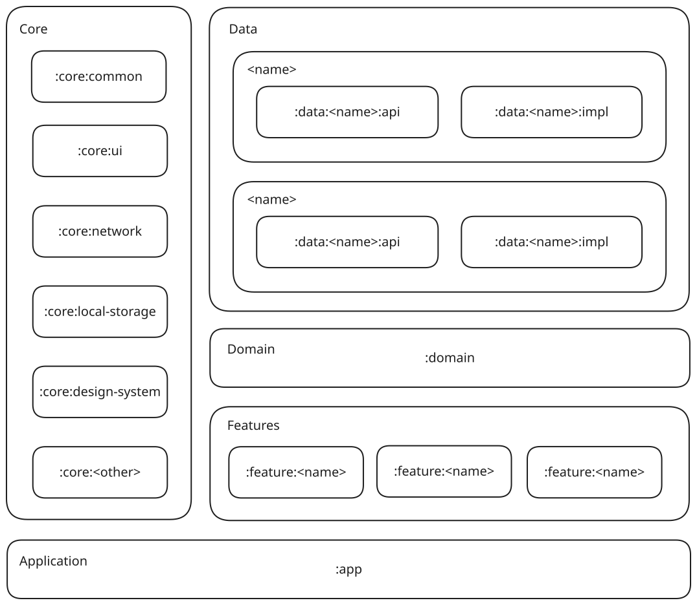
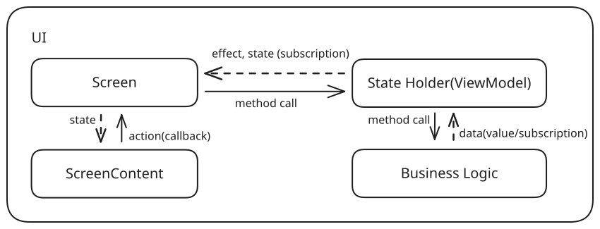

   

## О проекте
**BTchat** - это Android мессенджер с открытым кодом, позволяющий коммуницировать посредством Bluetooth.

## Архитектура
Упор в архитектуре сделан на максимальную масштабируемость, переиспользуемость и низкую связанность между модулями. Здесь бизнес логика  расположена максимально логично, по моему мнению, отдельно от фич. Фичи здесь - экраны/большие блоки ui, которые не имеют бизнес-логики. Доменный слой не делится на модули, т.к. в масштабе текущего проекта это бессмысленно. Каждый data-блок разделён на api и impl модули. Весь общий код вынесен в core-модули.
На UI-слой взята похожая на MVI архитектура, не перегруженная типичным для MVI бойлерплейтом, но сохраняющая принципы единого источника истины и однонаправленного потока данных.
Так же используется модуль build-logic для сборки, в котором расположен вспомогательный класс Config и Convention-плагины, для переиспользования конфигурации.

**И UI-слой:**

